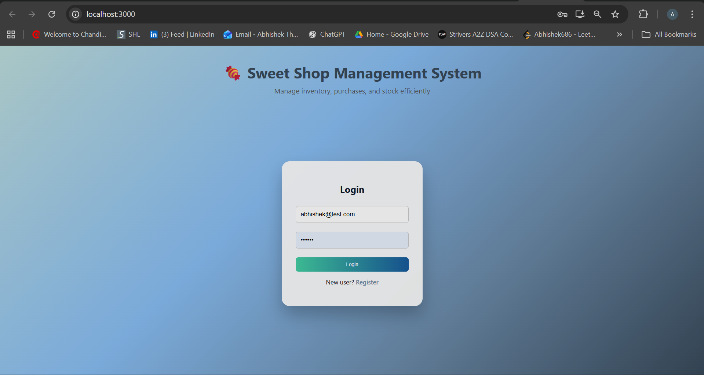
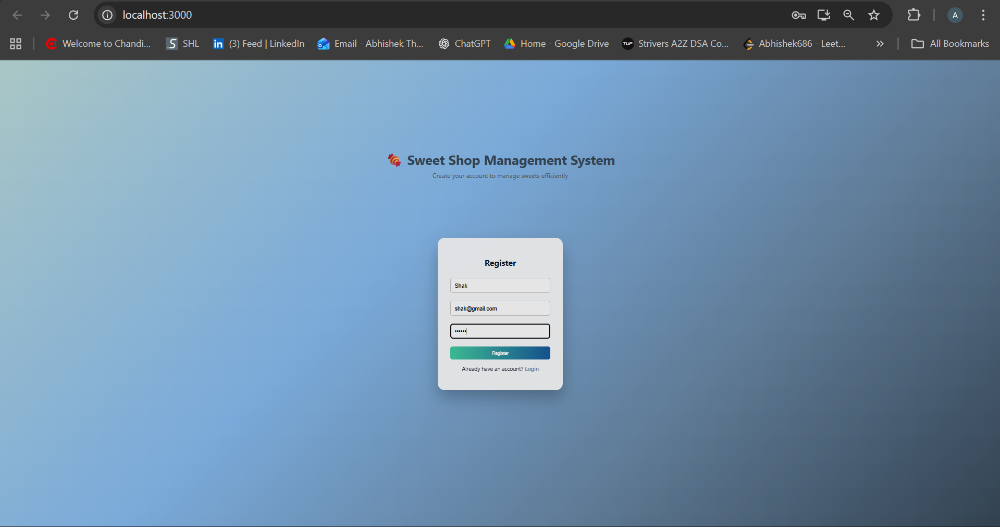
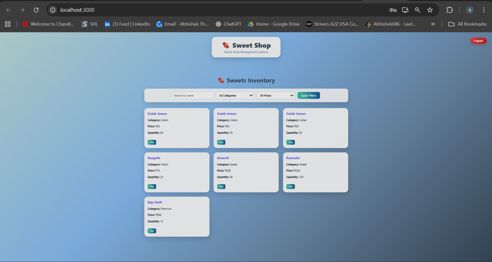
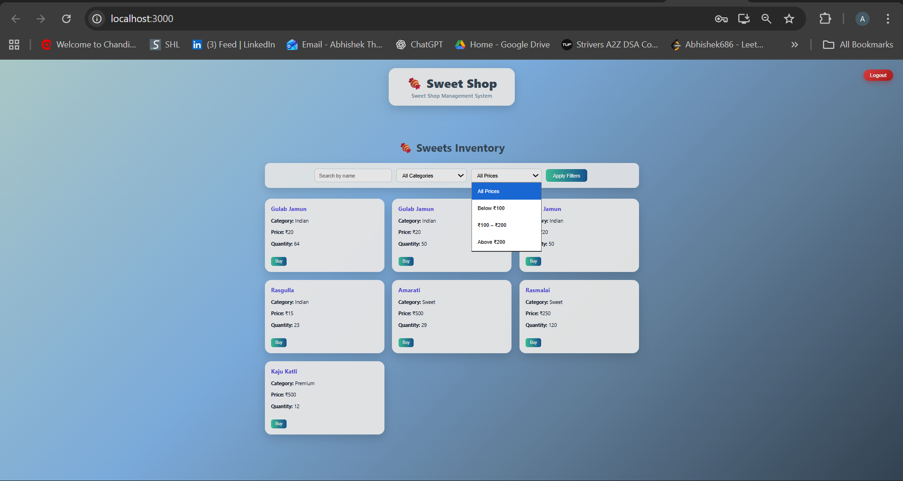
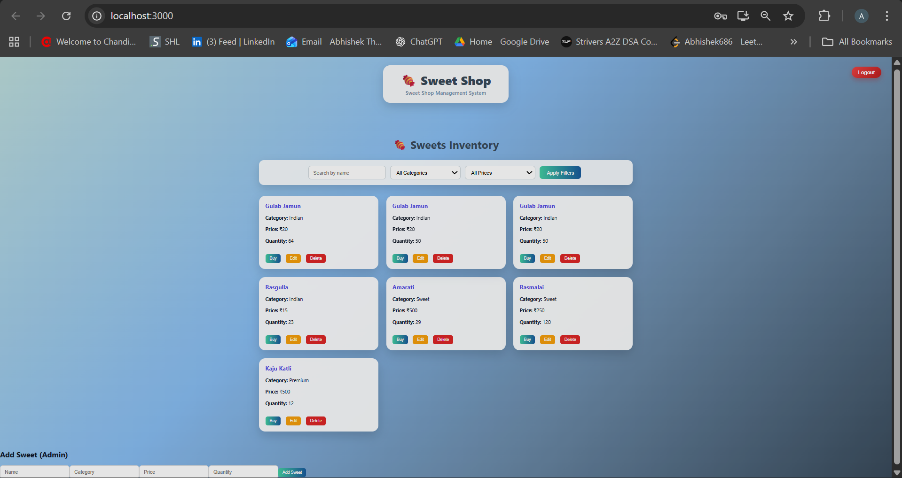

# Sweet Shop Management System 
# Sweet Shop Management System
## Project Structure

The project follows a clear separation of concerns with independent backend and frontend folders.

A full-stack Sweet Shop Management System built using **Node.js, Express, MongoDB, and React**.

The application allows users to browse sweets, purchase available items, and enables admins to manage inventory with role-based access control.

---

## Features

### Authentication & Authorization
- User registration and login using JWT
- Role-based access (Admin / User)
- Token expiry handling and logout

### Sweet Inventory
- View all sweets
- Search sweets by name
- Filter by category and price range
- Purchase sweets (disabled if out of stock)

### Admin Features
- Add new sweets
- Update price and quantity
- Delete sweets
- Automatic stock updates on purchase

### UI & UX
- Responsive React UI
- Clean card-based layout
- Disabled actions for unavailable items
- Clear visual distinction for admin actions

---

## Tech Stack

**Backend**
- Node.js
- Express.js
- MongoDB (Mongoose)
- JWT Authentication
- Jest & Supertest (Testing)

**Frontend**
- React
- Axios
- CSS (custom styling)

---

## Screenshots

### Login Page

### Register Page

### User Inventory

### Filters Feature

### Admin Dashboard

---

## My AI Usage

I used AI tools (primarily **ChatGPT**) as a development assistant during this project, mainly to **speed up frontend development and debugging**, while I implemented and understood the backend logic independently.

### Tools Used
- ChatGPT

### How I Used AI

**Frontend (Primary Usage)**
- Assisted in designing and refining the React UI layout (cards, filters, login/register screens).
- Helped debug React-specific issues such as:
  - `useEffect` dependency warnings (`react-hooks/exhaustive-deps`)
  - Component structuring and state management improvements
- Assisted in integrating Axios API calls with the backend.
- Helped refine CSS styling and improve overall UI/UX consistency.

**Backend**
- Used AI only for **reference and debugging guidance** related to:
  - JWT authentication error handling
  - Token expiry behavior and authorization flow
- All backend routes, controllers, models, and business logic were written and understood by me.

### My Reflection on AI Usage

AI helped me accelerate development and reduce time spent on repetitive debugging tasks, especially on the frontend.  
However, I ensured that I fully understood every piece of code I integrated and made conscious design decisions myself.

This approach allowed me to focus on **clean architecture, correctness, and maintainability**, while using AI responsibly as a productivity tool rather than a replacement for understanding.

## Project Structure

sweet-shop-management-system/
│
├── sweet-shop-backend/
│   ├── src/
│   │   ├── config/
│   │   │   └── db.js                # Database configuration
│   │   ├── controllers/
│   │   │   ├── authController.js    # Authentication logic
│   │   │   └── sweetController.js   # Sweet inventory logic
│   │   ├── middleware/
│   │   │   └── authMiddleware.js    # JWT & role-based authorization
│   │   ├── models/
│   │   │   ├── User.js              # User schema
│   │   │   └── Sweet.js             # Sweet schema
│   │   ├── routes/
│   │   │   ├── authRoutes.js        # Auth API routes
│   │   │   └── sweetRoutes.js       # Sweet API routes
│   │   └── app.js                   # Express app setup
│   │
│   ├── tests/
│   │   ├── auth.test.js             # Auth API tests
│   │   └── sweet.test.js            # Sweet API tests
│   │
│   ├── server.js                    # Server entry point
│   ├── package.json
│   └── .env
│
├── sweet-shop-frontend/
│   ├── public/
│   │   ├── screenshots/             # Application screenshots
│   │   └── index.html
│   │
│   ├── src/
│   │   ├── api/
│   │   │   └── api.js                # Axios API layer
│   │   ├── pages/
│   │   │   ├── Login.js
│   │   │   ├── Register.js
│   │   │   ├── Sweets.js
│   │   │   └── AddSweet.js
│   │   ├── utils/
│   │   │   └── auth.js               # Auth helpers
│   │   ├── App.js
│   │   ├── App.css
│   │   ├── index.js
│   │   └── styles.css
│   │
│   └── package.json
│
├── .gitignore
└── README.md
